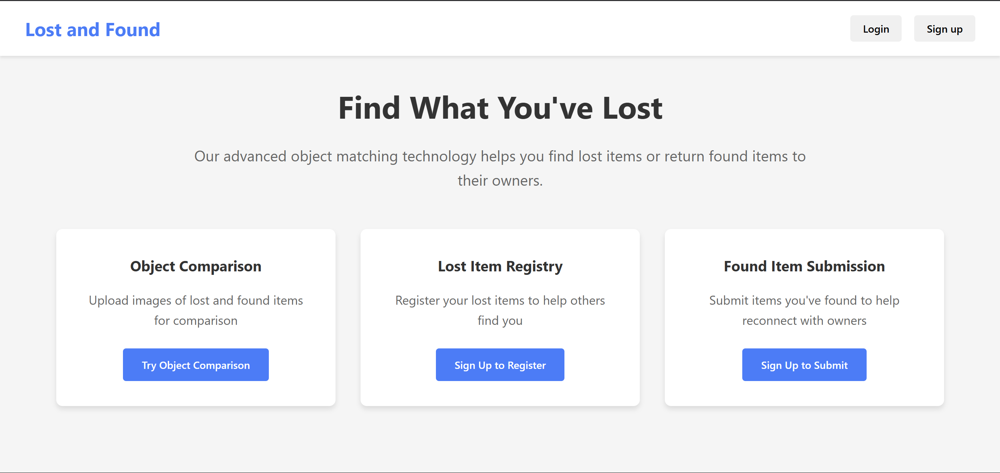

# Lost-Finder

Lost Finder is a web application designed to help users find lost items efficiently. The platform allows users to report lost and found items, categorize them, and search using filters. It features a user-friendly interface where users can upload images, add descriptions, and contact the person who found their lost item.

## Table of Contents

- [Features](#features)
- [Installation](#installation)
- [Usage](#usage)
- [Screenshots](#screenshots)
- [Contact](#contact)

## Features

- Report lost and found items
- Categorize items
- Search using filters
- Upload images
- Add descriptions
- Contact the person who found or lost an item

## Installation

To get started with Lost Finder, follow these steps:

1. Clone the repository:
   ```bash
   git clone https://github.com/vijaysolanki9079/Lost-Finder.git
   
2. Navigate to the project directory:
   ```bash
   cd Lost-Finder
3. Install the dependencies:
   ```bash
   npm install

4. Run the application:
   ```bash
   npm start

## Usage 
- Open the application in your web browser.
- Create an account or log in.
- Report a lost or found item by filling out the form and uploading relevant images.
- Use the search filters to find reports matching your criteria.
- Contact the person who reported the item if you find a match.

## Screenshots
Include some screenshots of your project to showcase the user interface and features.


## Contact
If you have any questions or suggestions, feel free to reach out:
- Vijay Solanki
- Email: vijaysolanki9079@gmail.com
- GitHub: vijaysolanki9079
